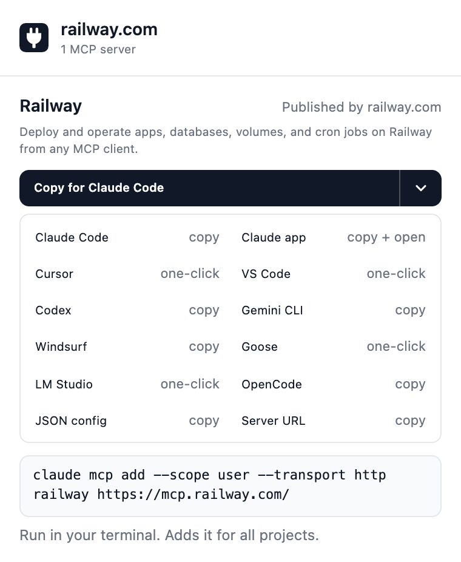

# MCP Here

**Every site with an MCP server, one click from your agent.**

A Chrome extension that lights up when the site you're on has an MCP server, then adds it to Claude Code, Cursor, VS Code and more.



## Install

1. `npm install && npm run build`
2. Open `chrome://extensions`, turn on **Developer mode**
3. **Load unpacked** → pick `dist/`

## Supported apps

| One-click | Copy a command or config |
| --- | --- |
| Cursor, VS Code, Goose, LM Studio | Claude Code, Codex, Gemini CLI, Windsurf, OpenCode, Claude app, any client (JSON or URL) |

Your last pick is remembered.

## How it finds servers

- **The site itself:** `/.well-known` server cards and AI Catalogs (Railway, GitHub, Sentry, Supabase)
- **The official MCP registry:** matched by verified domain (`com.stripe/mcp` → stripe.com), refreshed daily

No servers, accounts or tracking. Sites are only asked about their own `/.well-known` files.

## Develop

```sh
npm run watch      # rebuild on change
npm test           # unit tests
npm run typecheck
npm run index      # rebuild data/registry-index.json from the registry
npm run zip        # package for the Chrome Web Store
```

MIT
