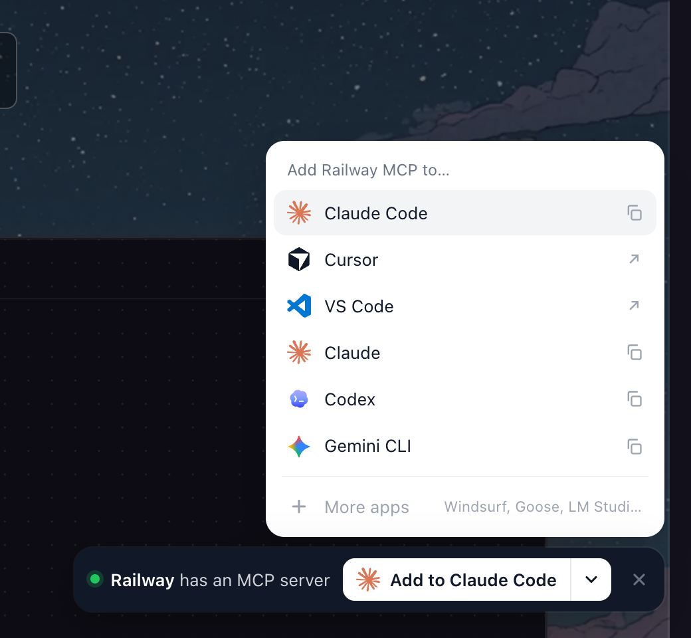

# MCP Here

**Stumble onto MCP servers while you browse.**

When a site has an MCP server, a small bar shows up in the corner. One click adds it to your agent.



## Install

1. `npm install && npm run build`
2. Open `chrome://extensions`, turn on **Developer mode**
3. **Load unpacked** → pick `dist/`

## Supported apps

| One-click | Copy a command or config |
| --- | --- |
| Cursor, VS Code, Goose, LM Studio | Claude Code, Claude, Codex, Gemini CLI, Windsurf, OpenCode, any client (JSON or URL) |

Your last pick becomes the main button.

## How it finds servers

- **A weekly store:** the official MCP registry (matched by verified domain) plus a crawl of the top 10,000 sites' `/.well-known` files, published to GitHub Pages
- **A live check:** each site you visit is checked once a week, so new or removed servers show up even before the store knows

Nothing leaves your browser. What it remembers about sites you visit is stored hashed.

## Develop

```sh
npm run watch                 # rebuild on change
npm test                      # unit tests
npm run typecheck
npm run index -- --top=500    # rebuild data/index.json with a smaller crawl
npm run zip                   # package for the Chrome Web Store
```

MIT
